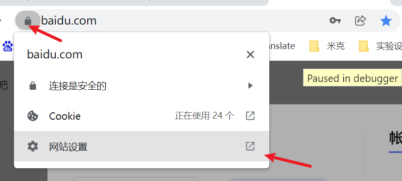
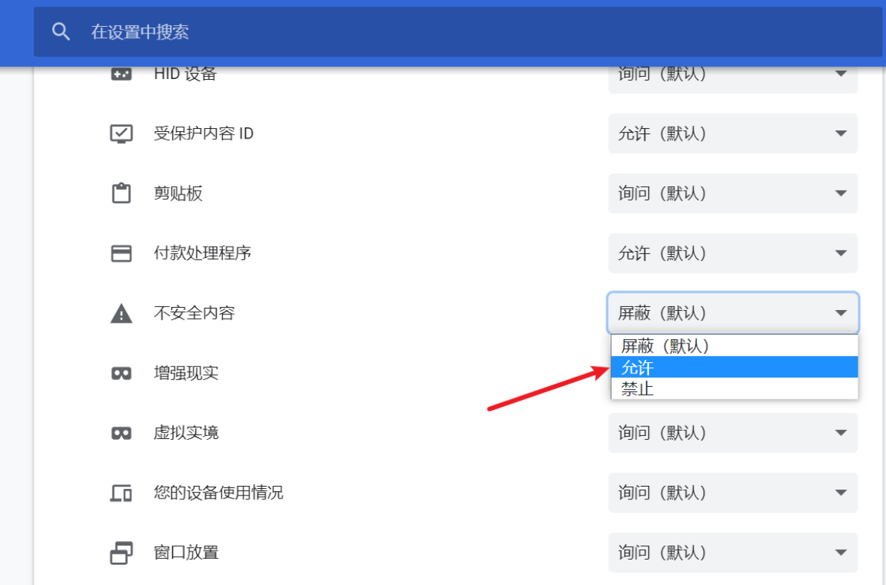
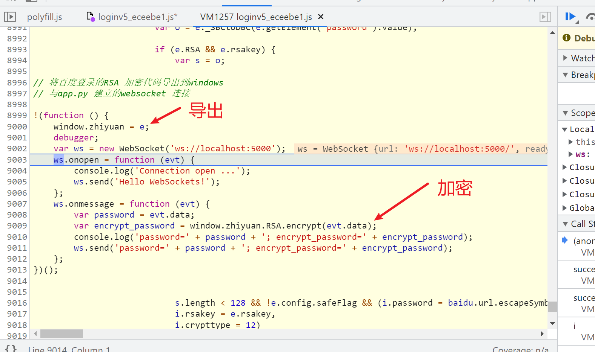
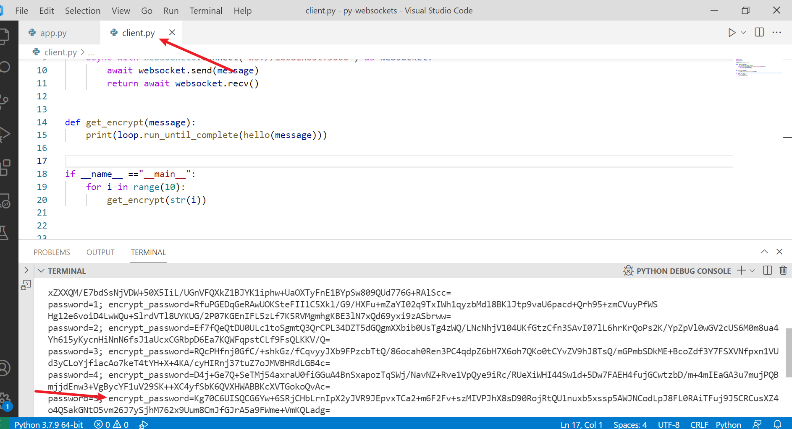

# RPC 百度登录实战记录

案例网站 百度登录 https://www.baidu.com/

目标使用RPC 免扣代码实现RSA加密

## 使用的工具或环境

chrome 开发者工具 `Overrides` 映射线上代码到本地

python 库 `websockets`


## 核心思路

手动定位到`e.RSA.encrypt`将其导出到window，并与本地5000端口的websocket服务器建立连接，后续加密只要发送到websocket服务器，就可以得到加密的结果


**流程图**

```mermaid
graph LR
   python --> websocket服务器 -->browser --> websocket服务器 --> python
   
```

### websocket服务器代码

起到桥梁的作用，内部逻辑简单，只是把消息转发给非发送方的其他客户端（python 或browser）

```python
import asyncio
import websockets
""" 
websocket 服务端

"""
connected = set()

async def server(websocket, path):
    # Register.
    connected.add(websocket)
    try:
        async for message in websocket:
            for conn in connected:
                # 发送消息到非发送方的所有客户端
                if conn != websocket:
                    # await conn.send(f'Got a new MSG FOR YOU: {message}')
                    print("Got",message)
                    await conn.send(message)
    finally:
        # Unregister.
        connected.remove(websocket)
    

start_server = websockets.serve(server, "localhost", 5000)

asyncio.get_event_loop().run_until_complete(start_server)
asyncio.get_event_loop().run_forever()

```


### browser 

chrome 开发者工具 `Overrides` 映射线上代码到本地

> 注意获取权限时点击允许
>
> 并在网站设置那里勾选，**允许加载不安全内容** ,相比于wss ws被浏览器视为不安全






定位密码加密的方法注入以下代码，作用是导出加密代码到window并连接websocket服务器，实现`onmessage`方法



```javascript
// 将百度登录的RSA 加密代码导出到windows
// 与app.py 建立的websocket 连接

!(function () {
    window.zhiyuan = e;
    var ws = new WebSocket('ws://localhost:5000');
    ws.onopen = function (evt) {
        console.log('Connection open ...');
        ws.send('Hello WebSockets!');
    };
    ws.onmessage = function (evt) {
        var password = evt.data;
        var encrypt_password = window.zhiyuan.RSA.encrypt(evt.data);
        console.log('password=' + password + '; encrypt_password=' + encrypt_password);
        ws.send('password=' + password + '; encrypt_password=' + encrypt_password);
    };
})();
```

注入部分完整代码位于文件`injected_baidu.js`

### python  客户端调用示例

 ```python
 import asyncio
 import websockets
 
 # 获取事件循环
 loop = asyncio.get_event_loop()
 
 async def hello(message):
     # 连接 websocket 并发送消息 获取相应
     async with websockets.connect("ws://localhost:5000") as websocket:
         await websocket.send(message)
         return await websocket.recv()
 
 
 def get_encrypt(message):
     print(loop.run_until_complete(hello(message)))
 
 
 if __name__ =="__main__":
     for i in range(1000):
         get_encrypt(str(i))
 ```


## 效果


python调用成功




感谢志远大佬的逆向课程
